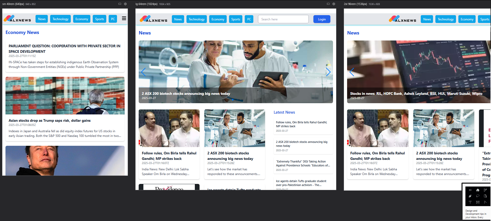

# 📰 ALX News App

A modern, responsive news reader built with **React**, **Tailwind CSS**, and **NewsAPI**. Users can browse the latest news by category, view full articles, search for topics, and register/login locally.

---

## 🚀 Live Demo

👉 [https://news-reader.vercel.app](https://news-reader.vercel.app)

---

## ✨ Features

- 📚 News categorized by topic: Technology, Economy, Sports, PC
- 🧲 Featured news carousel using Swiper.js
- 🔍 Real-time search functionality with context
- 📖 Article details with full content display
- 🆕 Sidebar showing the latest 5 articles
- 🎥 Embedded video inside sidebar
- 🔐 Login and Sign up with localStorage
- 🧭 Pagination for easy navigation
- 🌙 Dark mode *(coming soon!)*
- 📱 Fully responsive across mobile, tablet, and desktop

---

## 🧪 Technologies Used

- **React**
- **Vite**
- **Tailwind CSS**
- **Axios**
- **React Router**
- **Swiper.js**
- **Formik**

---

## 📱 Responsive Design

Layout optimized for `sm`, `lg`, and `2xl` screen sizes using Tailwind utility classes.

---

## 📁 Project Structure (Simplified)

bash
news-reader/
├── public/            # Static assets: images, videos, screenshots, data
├── src/
│   ├── assets/        # UI illustrations (login/signup)
│   ├── components/    # Reusable UI components
│   ├── context/       # Search context & provider
│   ├── pages/         # Main pages (News, Login, Article, etc.)
│   ├── services/      # API logic (Axios)
│   ├── App.jsx        # Layout structure
│   ├── main.jsx       # App entry with Router & QueryClient
│   └── index.css      # Tailwind base styles
├── .env               # API key
├── package.json       # Dependencies & scripts
├── vite.config.js     # Vite config
└── tailwind.config.js # Tailwind config

🧠 Future Improvements

🌙 Add full Dark Mode support using Tailwind's dark: classes
🔖 Allow users to bookmark/save favorite articles locally
🗂 Add filtering by category and tags
📝 Enable user comments per article
🎥 Integrate search for video content using YouTube API or similar
🧠 Improve search experience with auto-suggestions and fuzzy search
📈 Track usage with Vercel Analytics or Google Analytics
🌍 Add language support (multi-language UI)
✨ Add Admin Dashboard (for future CMS integration)

## ⚙️ Getting Started

Create a `.env` file in the root directory and add your NewsAPI key:

VITE_NEWS_API_KEY=your_api_key_here
bash
git clone https://github.com/arancar01/news-reader.git
cd news-reader
npm install
npm run dev

## Author

- **Name:** Errahmouni Hamza
- **GitHub:** [@arancar01](https://github.com/arancar01)
- **Email:** maradox6ken@gmail.com